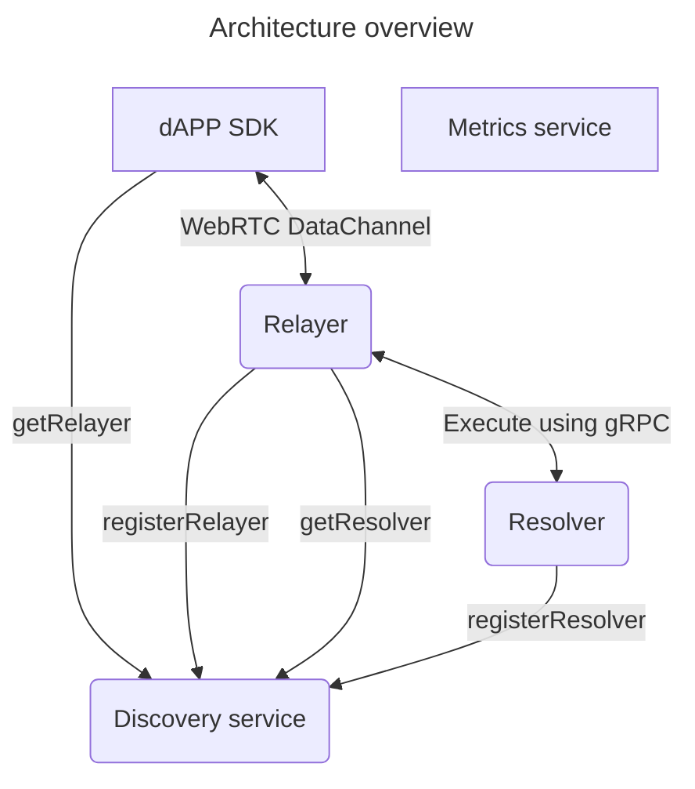
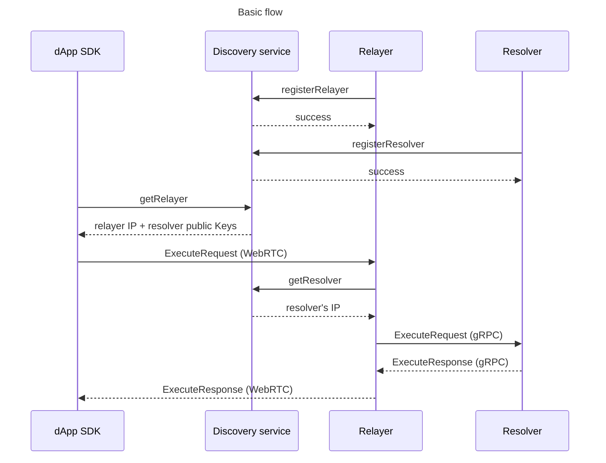
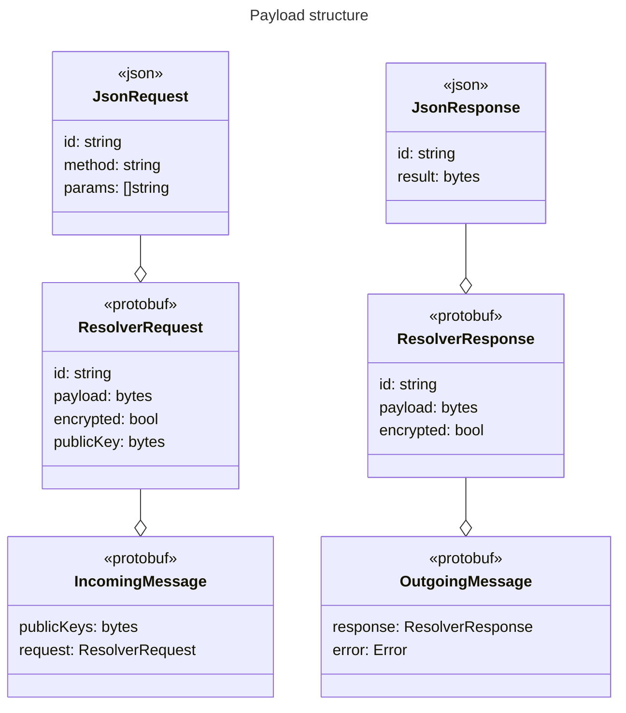
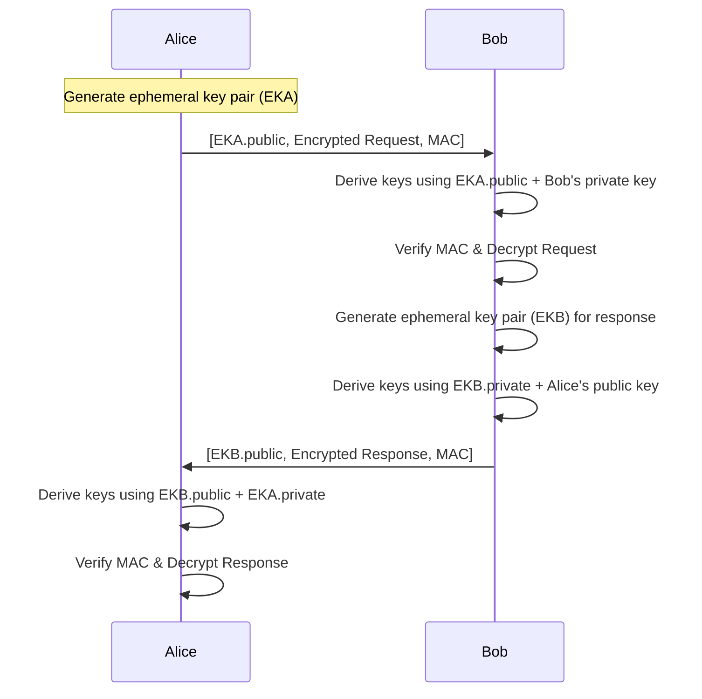

# Architecture overview

There are several key components to the architecture:

- dApp SDK
- Relayers
- Resolvers
- Discovery service
- Monitoring services

The successful flow is described in the below diagram:

## Payloads
Payloads travelling between dApp SDK, Relayers and Resolvers are Protobuf-wrapped JSON-RPC requests, with the following structure:

## dApp SDK
dApp SDK is a Typescript library that provides the following functionality:

- request execution
- encryption

SDK communicates with Relayers using WebRTC suite of protocols.

Prior to establishing communication with the Relayer, SDK asks Discovery service for a Relayer node candidate to use.

## Relayers

Relayers perform the following:

- register themselves via the Discovery Service
- process incoming WebRTC requests from dApp SDK
- pass request payloads to Resolvers via gRPC protocol

Relayers act as gRPC clients in the p2p-network architecture.

More info is in a dedicated [README](./cmd/relayer/README.md).

## Resolvers
Resolvers implement APIs supported by the p2p-network. 

They act as gRPC servers in the overall p2p-network architecture.

More info is in a dedicated [README](./cmd/resolver/README.md).

## Discovery service
Discovery service is a Ethereum smart contract that provides the following functionality:

- relayer registration (**registerRelayer(ip)**)
- resolver registration (**registerResolver(ip, pubKey)**)
- getting relayer and resolver public keys (**getRelayer()**)
- fetching resolver IPs by public key (**getResolver(pubKey)**)

## End-to-End Encryption Scheme (ECIES)

This section provides a concise overview of a ECIES (Elliptic Curve Integrated Encryption Scheme) request–response exchange between parties (dApp -> [Relayer (proxies)] -> Resolver), Alice (dApp) and Bob (Resolver). Each side uses elliptic-curve–based key agreement to derive symmetric keys for both encryption and authentication.

### Overview

1. **Alice → Bob (Request)**
   - Alice creates an ephemeral key pair.
   - She derives a shared secret with Bob’s public key, runs it through a KDF to get an encryption key and a MAC key.
   - Alice encrypts her request and computes a MAC.
   - She sends Bob:
     1. Her ephemeral public key  
     2. The encrypted request  
     3. The MAC tag

2. **Bob Receives & Processes**
   - Bob uses his private key and Alice’s ephemeral public key to derive the same keys.
   - He verifies the MAC and decrypts the request.
   - Bob processes the request and prepares a response.

3. **Bob → Alice (Response)**
   - Bob generates a fresh ephemeral key pair.
   - He derives a new shared secret with Alice’s corresponding public key.
   - Bob encrypts his response and computes a MAC.
   - He sends Alice:
     1. His ephemeral public key  
     2. The encrypted response  
     3. The MAC tag

4. **Alice Receives & Verifies**
   - Alice recreates the shared secret with Bob’s ephemeral public key.
   - She verifies the MAC and decrypts the response.

### Sequence Diagram

## Monitoring services

# Deployment
All application components are Dockerized. There is a `docker-compose.yml` that can be used for containerized deployment of the architecture described above (excluding monitoring services).
