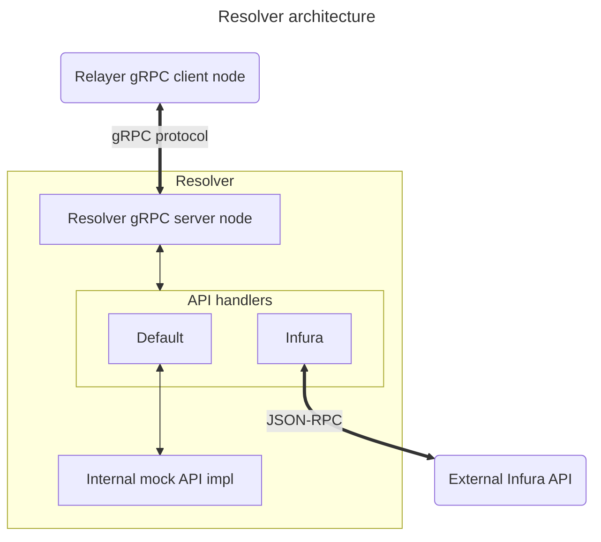

# Overview
Resolver application serves as a lowest-level endpoint in the p2p-network architecture.

It processes requests received from the relayer and forwards them to the API(s) that it wraps.

Currently 2 APIs are support: a mock (default) one, and an external Infura API.


# Testing notes

## Preparation
First, run the resolver node.

In one terminal session, execute:
```
make build_resolver
bin/resolver run
```
By default resolver listens on port 8001, this can be overridden via `--port` parameter like so:
```
bin/resolver run --port=8888
```
Additionally, one can provide a YAML file with the resolver configuration, and pass its path as the `--configFile` parameter:
```
bin/resolver run --configFile resolver_config.yaml
```

## grpcurl
Now one can test gRPC server responses via `grpcurl`:

1. Failed request (empty JSON)
`grpcurl -plaintext localhost:8001 proto.Execute/Execute` should return:
```
{
  "status": "RESOLVER_ERROR"
}
```
2. Successful request (GetWalletBalance payload):
```
PAYLOAD=$(jq '. | @base64' <<< '{"id": "new", "method": "GetWalletBalance", "params": ["0x1234", "latest"]}')

grpcurl -plaintext -d "{\"id\": \"1\", \"payload\": $PAYLOAD}" localhost:8001 proto.Execute/Execute | jq '.payload | @base64d | fromjson'

```
Output:
```
{
  "id": "new",
  "result": 0,
  "error": null
}
```
**Note**: we first base64-encode the payload to be sent to gRPC. In the above example `jq` is used for base64 encoding.

## Postman
Postman can also be used for testing. 

  - Open Postman
  - In `File->New...` dialog, select `gRPC`.
  - In the Request window, pick your resolver's IP address (by default, this will be `localhost:8001`)
  - And select the service name to test (`Execute/Execute`). If it's not visible, click on `Use Server Reflection`
  - Now, click `Use Example Message` in order to fill in the JSON request template
  - Note that payload has to be base64-encoded, as in the grpcurl example above. The response payload also needs to be decoded.

## HealthCheck
Resolver have standardized health check endpoints:
- Watch - allows you to subscribe to the change service status 
- Check - allows you ask current service status

Both api have same empty request body. You can also try this endpoints in postman using server reflection.