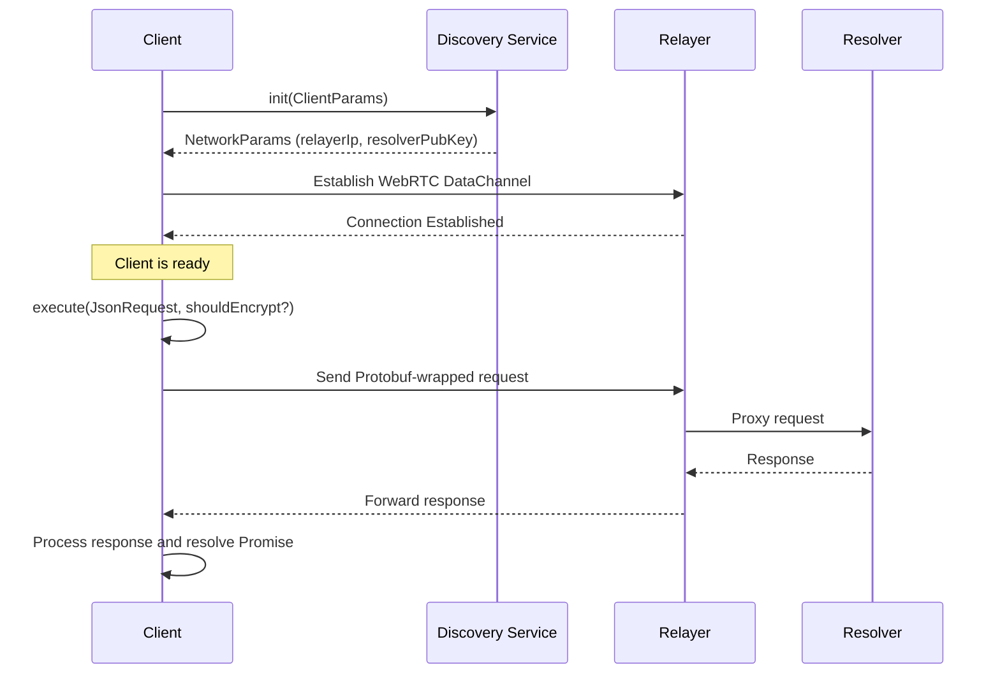

# 1inch P2P SDK Documentation

A TypeScript SDK for interacting with the 1inch P2P decentralized network via a WebRTC DataChannel. This SDK provides methods to initialize the connection and execute requests with optional encryption, all while using an unified logging system.

---

## Overview

The SDK exports a `Client` class that handles all interactions with the backend. It connects to a discovery service to fetch network parameters (such as available relayers and resolvers), establishes a WebRTC DataChannel connection, and provides methods to execute API requests. Requests can be optionally encrypted (by default) using the resolver's public key, and responses are decrypted using a per-request ephemeral asymmetric keypair.

---

## Installation

Install the dependencies of the SDK via npm:

```bash
cd sdk
npm i
```

---

## Quick Start

Below is a sample usage that demonstrates how to instantiate the client with a logger, initialize the connection, and execute a request:

```typescript
import { Client, ClientParams, JsonRequest, JsonResponse, Logger } from '1inch-p2p-sdk'; // locally relative path to SDK

// Create a logger instance (your logger should implement the Logger interface)
const logger: Logger = {
  info: (...args: any[]) => console.log(...args),
  warn: (...args: any[]) => console.warn(...args),
  error: (...args: any[]) => console.error(...args),
  debug: (...args: any[]) => console.debug(...args),
};

// Instantiate the client with the logger.
const client = new Client(logger);

// Initialize the client.
const clientParams: ClientParams = {
  providerUrl: "http://localhost:8545",
  contractAddr: "0x5FbDB2315678afecb367f032d93F642f64180aa3",
};

client.init(clientParams)
  .then((connected: boolean) => {
    if (connected) {
      // Prepare a request.
      const request: JsonRequest = {
        Id: "request-1",
        Method: "GetWalletBalance",
        Params: ["0x1234567890abcdef1234567890abcdef12345678", "latest"],
      };
      
      // Execute the request (encrypted by default)
      client.execute(request).then((response: JsonResponse) => {
        console.log("Response received:", response);
      }).catch(err => {
        console.error("Request error:", err);
      });
    }
  })
  .catch(err => console.error("Initialization error:", err));
```

---

## API Reference

### Client Class

The main class provided by this SDK is `Client`, which manages connection and communication with the backend via a WebRTC DataChannel.

#### Constructor

`new Client(logger: Logger)`

- **Parameters:**
  - `logger` (Logger): An object implementing the Logger interface. The logger should provide the following methods:
    - `info(...args: any[]): void`
    - `warn(...args: any[]): void`
    - `error(...args: any[]): void`
    - `debug(...args: any[]): void`

#### Methods

##### `init(clientParams: ClientParams): Promise<boolean>`

Initializes the client by connecting to a discovery service that fetches available relayers and resolvers, then establishes a WebRTC DataChannel connection to a relayer.

- **Parameters:**
  - `clientParams` (ClientParams): An object containing:
    - `providerUrl` (string): The URL of the blockchain provider.
    - `contractAddr` (string): The address of the smart contract.
- **Returns:**  
  A Promise that resolves to `true` once the WebRTC connection to a relayer is established.

##### `execute(request: JsonRequest, shouldEncrypt?: boolean): Promise<JsonResponse>`

Executes an API request by performing these steps:
1. **Encryption:**  
   Encrypts the request payload using the resolver's public key (obtained during initialization) unless encryption is disabled.
2. **Keypair Generation:**  
   Generates a unique asymmetric Secp256k1 keypair for the request, used for response decryption.
3. **Protobuf Wrapping:**  
   Wraps the request in a Protobuf message and sends it over the WebRTC DataChannel.
4. **Response Handling:**  
   Waits for a response on the DataChannel’s `onmessage` event and conditionally decrypts it using the corresponding private key before resolving the Promise.

- **Parameters:**
  - `request` (JsonRequest): An object structured as follows:
    ```typescript
    export type JsonRequest = {
      Id: string;
      Method: string;
      Params: string[];
    };
    ```
  - `shouldEncrypt` (optional, boolean): Defaults to `true`. If `false`, the request payload is sent unencrypted.
- **Returns:**  
  A Promise that resolves with a `JsonResponse`:
    ```typescript
    export type JsonResponse = {
      id: string;
      result: any;
    };
    ```

### Type Definitions

```typescript
type NetworkParams = {
  relayerIp: string,
  resolverPubKey: string,
};

type ClientParams = {
  providerUrl: string,
  contractAddr: string,
};

export interface Logger {
  info: (...args: any[]) => void;
  warn: (...args: any[]) => void;
  error: (...args: any[]) => void;
  debug: (...args: any[]) => void;
}

export type JsonRequest = {
  Id: string;
  Method: string;
  Params: string[];
};

export type JsonResponse = {
  id: string;
  result: any;
};

export type PendingRequest = {
  resolve: any;
  reject: any;
  privKey: any;
}
```

---

## Flow Overview

The SDK follows a two-stage process:

1. **Initialization (`init()`):**
   - The client fetches network parameters (relayer IP and resolver public key) from a smart contract using the provided `ClientParams`.
   - It then establishes a WebRTC DataChannel connection to a relayer.
   - Once the connection is established, the `init()` method resolves, and the client becomes ready to execute API requests.

2. **Request Execution (`execute()`):**
   - The client optionally encrypts the request payload with the resolver's public key (unless encryption is disabled via a flag).
   - A unique ephemeral asymmetric Secp256k1 keypair is generated for the request, which is later used for decrypting the response (ECIES encryption scheme). 
   - The request is wrapped in a Protobuf message and sent over the established WebRTC DataChannel.
   - The client waits for a response on the DataChannel's `onmessage` event.
   - Upon receiving the response, the client conditionally decrypts it (if marked as encrypted) using the client private key, and then resolves the promise with a `JsonResponse` (ECIES encryption scheme).

Below is a sequence diagram that illustrates the flow:



---

## Local Setup

### Local Registry Contract deployment
Run Anvil e.g. via Docker:
```
docker run -p 8545:8545 --platform linux/amd64 ghcr.io/foundry-rs/foundry:latest "anvil --host 0.0.0.0"
```

Then issue the following commands in order to deploy mock registry contract and register default test resolver:
```
make deploy_contract
make register_nodes
```

### Run relayer node

```
make build_relayer_local
bin/relayer run --config ./relayer.config.example.yaml
```

### Run resolver node
```
make build_resolver_local
bin/resolver run --api=infura --infuraKey=a8401733346d412389d762b5a63b0bcf --privateKey=5de4111afa1a4b94908f83103eb1f1706367c2e68ca870fc3fb9a804cdab365a  --grpc_endpoint=127.0.0.1:8001
```

---

## Examples

Located in `examples` folder.

### Basic WEB dApp
The SDK includes a sample web dApp that demonstrates real-world usage of the Client SDK. In this sample application, you will find:

- **Connection State Indicator:**  
  Displays "Connecting" initially and updates to "Connected" or "Disconnected" based on the WebRTC connection status.

- **Collapsible Logs Section:**  
  A Bootstrap accordion that shows detailed log messages (DEBUG, INFO, WARN, ERROR) from both the main application and the client.

- **Collapsible Methods Section:**  
  Each API method is presented in its own collapsible accordion item:
  - **Get Balance:**  
    Contains an input field for an address (with a default value) and a greyed-out, read-only result area. Clicking the "Get Balance" button fetches the balance.
  - **Send Funds:**  
    Contains a button to simulate a funds transfer and a result area to display the outcome.

- **Encryption Toggle:**  
  An "Encrypt Request" checkbox allows the user to toggle whether outgoing requests are encrypted.

- **Unified Logging:**  
  Both the main application and the client use a unified logger. The client is instantiated with a logger passed to its constructor, and log messages are differentiated by context (e.g., `[MAIN]` vs. `[CLIENT]`).

#### Sample dApp Run Instructions:
1. **Install Dependencies:**  
   Open your terminal, navigate to the project directory, and run:
   ```bash
   npm install
   ```
2. **Start the Development Server:**
   ```bash
   npm run dev
   ```
3. **Build Application:**
   ```bash
   npm run build
   ```
4. **Preview the Build:**
   ```bash
    npm run preview
  ```
